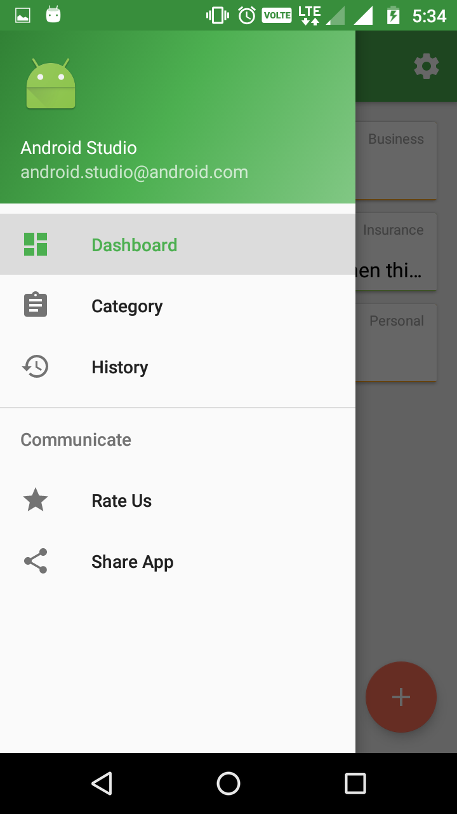
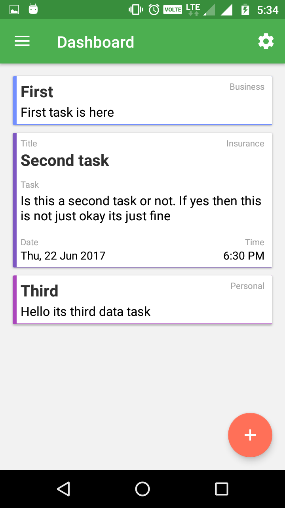
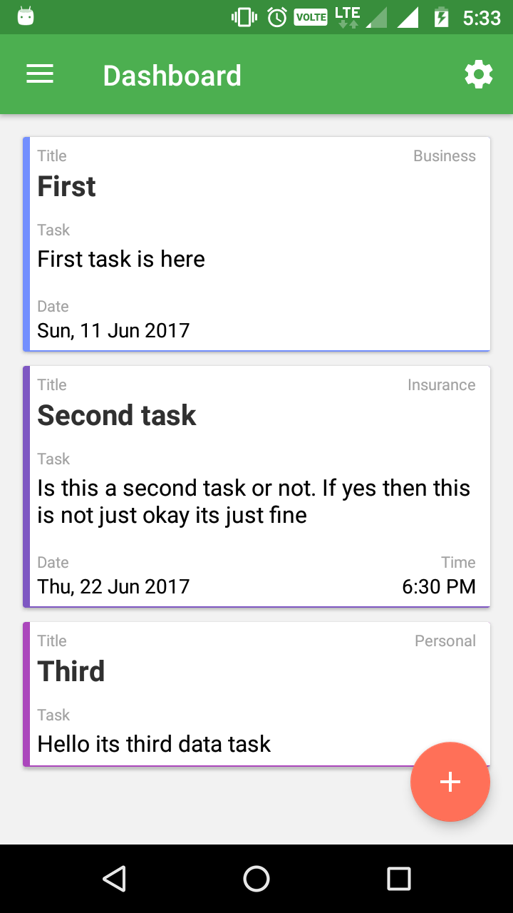
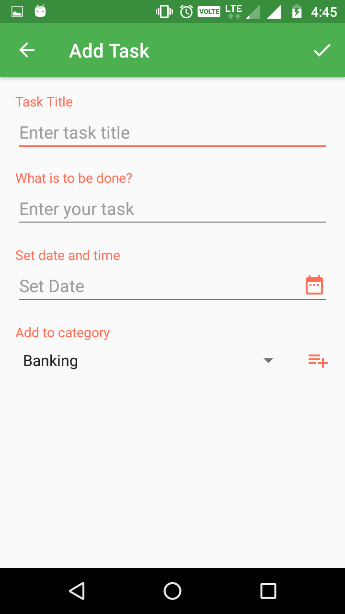
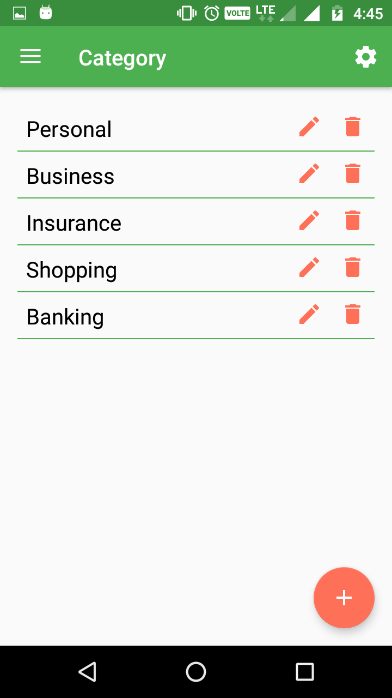
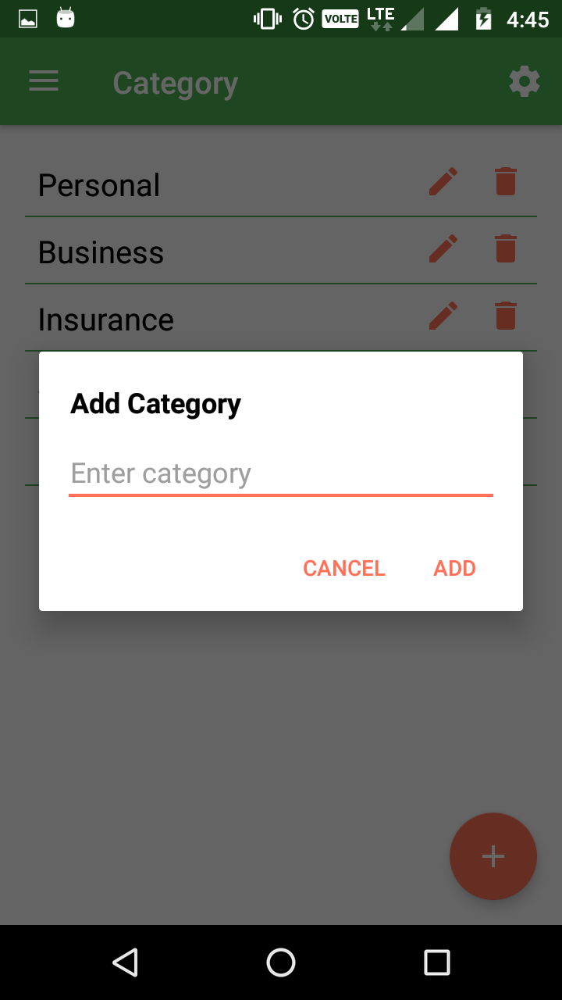

# Todo
Todo Android app using Kotlin

This app is use for daily tasks. User can create task, edit task and delete task. In Task you can add to category, that which task belong to which category. User can also manage Category, add, update and delete category. User can also add date and time for reminder.

Screenshots
-------------

      

License
-------

Copyright 2017 Pinkal Patel Open Source Project.

Licensed under the Apache License, Version 2.0 (the "License");
you may not use this file except in compliance with the License.
You may obtain a copy of the License at

http://www.apache.org/licenses/LICENSE-2.0

Unless required by applicable law or agreed to in writing, software
distributed under the License is distributed on an "AS IS" BASIS, WITHOUT
WARRANTIES OR CONDITIONS OF ANY KIND, either express or implied.  See the
License for the specific language governing permissions and limitations under
the License.
