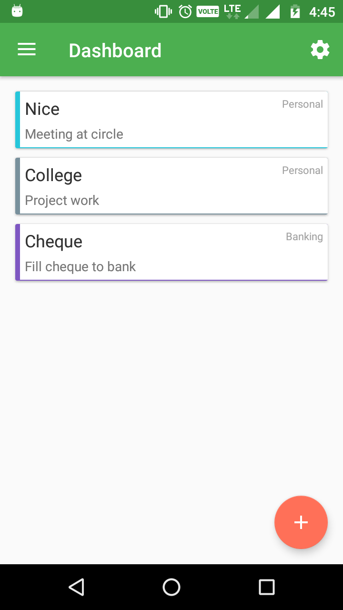

# Todo
Todo Android app using Kotlin

This app is use for daily tasks. User can create task, edit task and delete task. In Task you can add to category, that which task belong to which category. User can also manage Category, add, update and delete category. User can also add date and time for reminder.

Screenshots
-------------

   